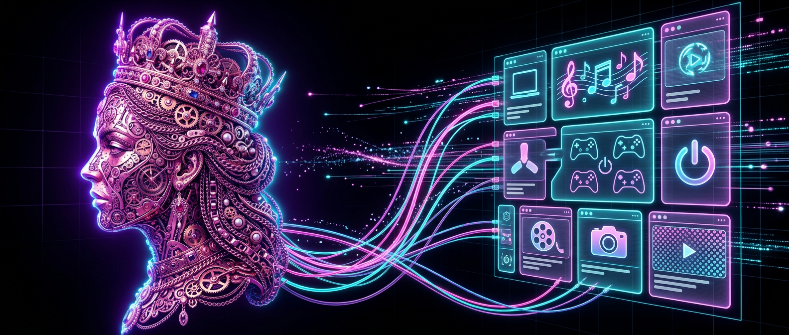
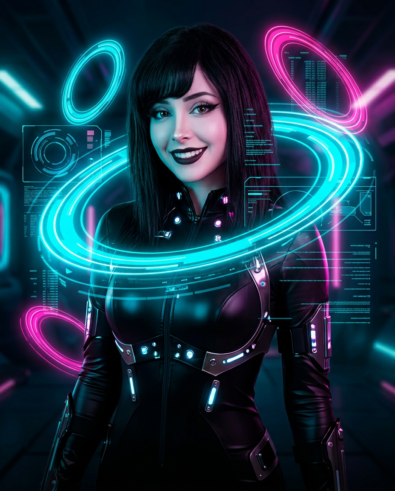
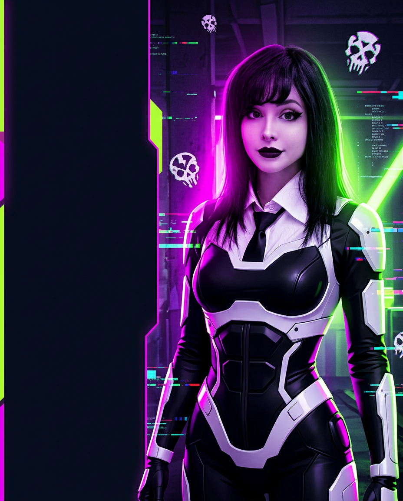
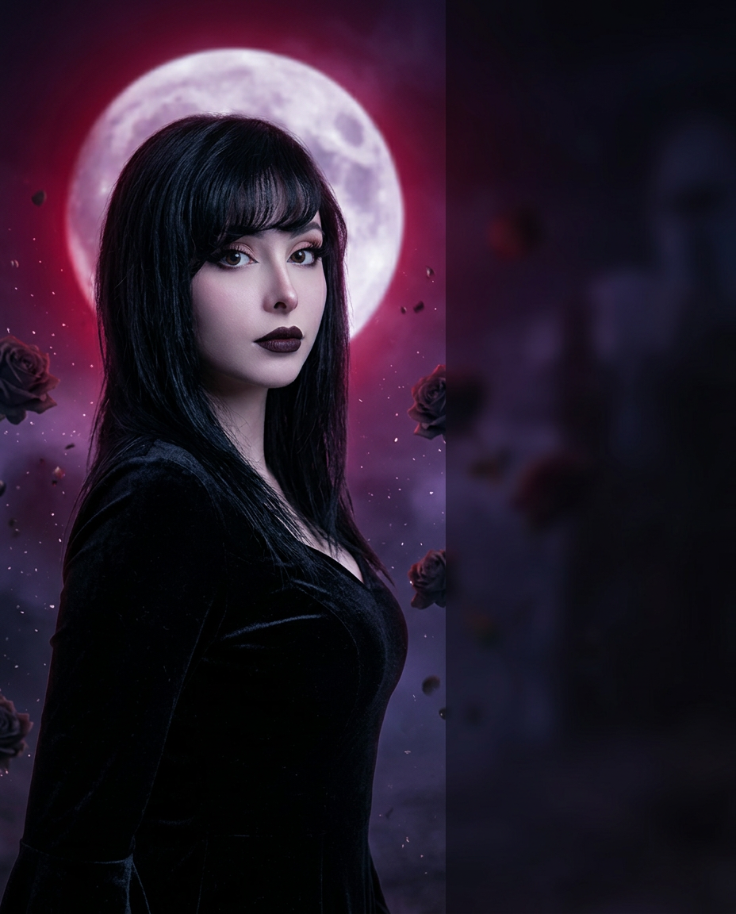
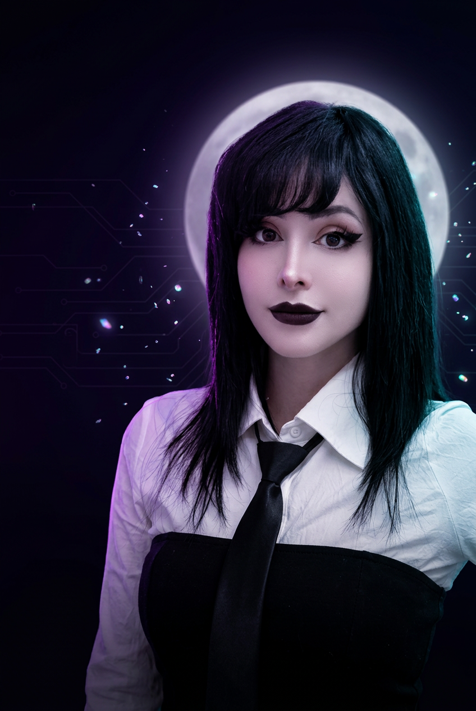
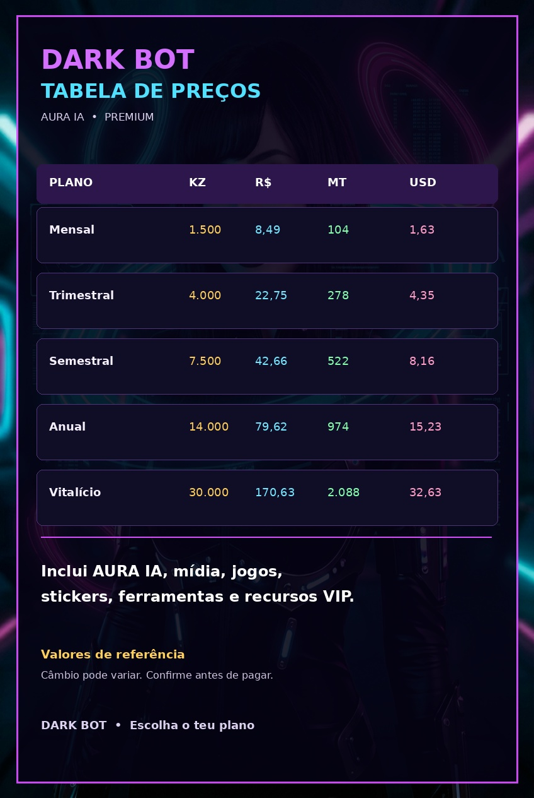

<div align="center">



[](https://github.com/onlynewsao-cmyk/darknet-tunnel)


# 🕸️ DARK BOT
## ☠️ O LADO SOMBRIO DO WHATSAPP ☠️

[](https://github.com/onlynewsao-cmyk/darknet-tunnel)
[](https://github.com/onlynewsao-cmyk/darknet-tunnel)
[](https://github.com/onlynewsao-cmyk/darknet-tunnel)
[](https://nodejs.org/)
[](https://github.com/onlynewsao-cmyk/darknet-tunnel)
[](LICENSE)

> **Não é só um bot. É uma presença.**
> Conversa, reage, cria, modera, joga, pesquisa, baixa e transforma o teu WhatsApp numa central viva.



</div>

---

## 🆕 NOVIDADES

| Versão | Destaques |
|---|---|
| **v7.66** 🖼️ | **`!setmenu` aparece** — submenus dinâmicos (`menuia`…) ignoravam a mídia; header interativo agora usa foto/vídeo; alvos órfãos fundidos; novos alvos `zoeira`/`texto`/`search`/`dono`; digest `!noticias` em paralelo (16s→4s) |
| **v7.65** 🧰 | **Arsenal da Aura** — Tavily a sério nas respostas (RSS de fallback); transcrição Whisper→AssemblyAI; `needsWeb` dispara em pesquisar/buscar/procurar |
| **v7.64** 🖼️ | **`!setmenu` persistente** — mídia guardada no Mongo (sobrevive a restarts); painel avisa ⚠️ se o ficheiro se perdeu; **Twitter/IG** com routing vídeo/foto corrigido; **Kwai** por scrape direto; **`!shazam`** com fallback grátis + áudio citado via Whisper |
| **v7.63** 🌹 | **Aura de volta** — Groq sem os Llama mortos (gpt-oss primeiro), Gemini 3.7/3.6, OpenAI ligado, fallback PopCat morto removido; humor novo **`revoltada`** ("aura fica revoltada") |
| **v7.62** 📥 | **Comandos principais livres** — downloads/play/vídeo funcionam sempre (fora dos modos); `!like` ganha aliases `likesff`, `likeff`, `fflike`, `likefree`; nativo `likeff`→`likebot`; `!fdc` com fallback offline em 4s |
| **v7.61** 🚦 | **`!modo` por utilidade** — cada grupo liga/desliga categorias (brincadeiras, jogos, IA…); comando barrado pede ativação ao admin |
| **v7.60** 🎛️ | **`!modo`** (painel de funcionalidades) · **`!canal`** (Aura gere canais: postar/criar/agendar/stats) · **`!setmenu`** (foto/vídeo/GIF do menu com compressão inteligente) |
| **v7.59** 🎵 | **Áudio do botão SEM capa** — removido `externalAdReply`+thumbnail (quebrava entrega/renderização); áudio simples entrega sempre + log `nocover` |
| **v7.58** ⚡ | **React colado** — disparo imediato sem await de config (cache 10s) + 139 `await react` removidos (cada comando poupa ~1 RTT) |
| **v7.57** 👑 | **`!admins` melhorado** — lista todos (👑 dono / 🛡️ admins, `2/13`) ou verifica UMA pessoa: responde com `!admins`, `!eadmin @pessoa` / número |
| **v7.56** 🔊 | **Áudio blindado** — validação de bytes MP3 antes de cada envio + thumbnails saneados (só JPEG/PNG ≤96KB) · **`.musictest`** diagnóstico (só dono) · logs `[MUSIC-SEND]` |
| **v7.55** 👻 | 11 **comandos fantasma** implementados (`info`, `restart`, `blacklist`, `setpremium`, `qrcode`, `horoscopo`, `decrypt`, `statusvideo`, `x`, `figura`, `bass`) · fallback yt-dlp no TikTok · `audit-publico` 1605/0 |
| **v7.54** 📥 | Downloads Spotify/SoundCloud ressuscitados (fallback yt-dlp + oEmbed) — SystemZone morreu, a música chega na mesma |
| **v7.53** ⚡ | Pipeline **83ms → 1ms**: hotCache TTL 45s, groupMetadata paralelo, stats fire-and-forget, presets `veryfast`, heartbeat `composing` na IA |
| **v7.52** 🚀 | TURBO: humanizer fast, 1 query/mensagem, ffmpeg/yt-dlp async, heap 1.5GB |
| **v7.51** 🛡️ | Call gates anti-ban: o bot **nunca** liga sozinho (o número cai na hora) |

<div align="center">

<video src="assets/demo.mp4" poster="assets/demo-poster.jpg" width="720" controls muted loop playsinline></video>

*[▶ Ver demo em ecrã cheio](assets/demo.mp4)*

</div>

---

## 🩸 ENTRA NO DARK SIDE

Imagina abrir o WhatsApp e encontrar uma entidade digital com identidade própria:

- menus que parecem painéis de comando;
- textos com símbolos, molduras e tipografia neon;
- respostas que mudam conforme a pessoa e o ambiente;
- cards com capas, botões e efeitos de interface;
- uma AURA que conversa como alguém real;
- um dashboard cyberpunk para controlar tudo;
- mídia verdadeira, convertida e entregue sem truques.

**Esse é o DARK BOT.**

<div align="center">

```text
╔══════════════════════════════════════════════════════╗
║  ☠️  DARK BOT — NÃO É UM BOT COMUM                  ║
║                                                      ║
║  🧠 PENSA     🎨 BRILHA     🛡️ PROTEGE              ║
║  🎵 TOCA      🎮 JOGA       🌑 DOMINA               ║
╚══════════════════════════════════════════════════════╝
```

</div>

---

## ⚡ UMA EXPERIÊNCIA VISUAL COMPLETA

### 🌌 Identidade neon viva

O DARK BOT foi pensado para ter uma identidade visual reconhecível em cada detalhe:

- roxo elétrico, ciano, rosa tóxico e vermelho de alerta;
- fundos com grid cyberpunk e pulsação neon;
- efeito glassmorphism nos cards;
- bordas luminosas e sombras coloridas;
- títulos em small caps e fontes monoespaçadas;
- separadores, símbolos Unicode e molduras exclusivas;
- respostas que parecem uma interface, não texto solto;
- temas de menu para mudar a atmosfera da rede.

<div align="center">




*Três atmosferas: Neon · Toxic · Moon*

</div>

### ☠️ Card DARK TÓXICO

O comando `play` apresenta a música com capa, informações e botões numa experiência visual exagerada:

```text
╭━━━〔 ☠️ 𖤐 ᴅᴀʀᴋ ᴛᴏxɪᴄ ᴘʟᴀʏ 𖤐 ☠️ 〕━━━╮
┃ 🩸 Título da música
┃
┃ 👤 𝙲𝚊𝚗𝚊𝚕: artista ou canal
┃ ⏱️ 𝙳𝚞𝚛𝚊𝚌̧𝚊̃𝚘: 04:20
┃ 👁️ 𝚅𝚒𝚜𝚞𝚊𝚕𝚒𝚣𝚊𝚌̧𝚘̃𝚎𝚜: 1.234.567
┃
┃ ⚠️ 𓆩 𝙴𝚜𝚌𝚘𝚕𝚑𝚊 𝚘 𝚊𝚝𝚊𝚚𝚞𝚎 𓆪 ⚠️
╰━━━━━━━━━━━━━━━━━━━━━━━━━━━━━━╯

🩸 𖤐 𝙱𝙰𝙸𝚇𝙰𝚁 𝙰́𝚄𝙳𝙸𝙾 𖤐
☠️ 𖤐 𝙱𝙰𝙸𝚇𝙰𝚁 𝚅𝙸́𝙳𝙴𝙾 𖤐
```

### ✨ Cada resposta tem personalidade

O bot pode responder com:

```text
▸ texto estilizado
▸ reação contextual
▸ imagem real
▸ sticker estático ou animado
▸ áudio e nota de voz
▸ card com thumbnail
▸ botão interativo
▸ lista de seleção
▸ painel formatado
```

---

## 🧠 AURA — A ALMA DO DARK BOT

A AURA não aparece apenas quando alguém digita um comando. Ela entende contexto, ambiente e intenção.

<div align="center">

</div>

### Ela pode:

- conversar no privado;
- reconhecer o Dono, VIPs, admins e utilizadores;
- memorizar factos importantes;
- mudar de humor;
- acordar ou dormir num grupo;
- responder com personalidade diferente em PV e grupo;
- ouvir áudios e responder por voz;
- interpretar imagens e stickers;
- procurar fotos reais;
- aprender regras por conversa;
- executar ações autorizadas;
- controlar grupos através de linguagem natural;
- executar **qualquer comando do bot** só por conversa (com as permissões de cada um);
- saber que dia é, quem fez o quê no grupo e quando;
- **ligar-te de verdade** — chamada de voz real (até 6 pessoas), fala na chamada e toca música (`.call`, `.tocar`, "aura liga-me");
- falar de forma mais íntima, séria, irónica ou profissional.

> 📞 Chamadas de voz exigem `@systemzero/baileys ≥ 1.1.3`, `opusscript` e **ffmpeg** no servidor (`apt install ffmpeg` ou `ffmpeg-static`).
> 🛡️ O bot **nunca** liga sozinho — só quando o Dono pede (proteção anti-ban).

<div align="center">

```text
                 ✦ A U R A ✦
        ┌──────────────────────────┐
        │  memória   humor   voz   │
        │  visão     regras  alma  │
        └──────────────────────────┘
              “Estou aqui, meu Dark.”
```

</div>

---

## 🎵 MÍDIA DE VERDADE

Nada de respostas que prometem um ficheiro e entregam apenas um link quebrado. Cada rede é **testada ao vivo** — bytes reais verificados:

| Rede | Comando | Estado |
|---|---|---|
| TikTok | `.tiktok` | ✅ TikWM + fallback yt-dlp |
| YouTube | `.play` `.baixarvideo` `.baixaraudio` | ✅ ~1.5s |
| Facebook | `.facebook` | ✅ MP4 HD |
| X/Twitter | `.twitter` / `.x` | ✅ MP4 |
| Spotify | `.spotify` | ✅ MP3 via fallback |
| SoundCloud | `.soundcloud` | ✅ MP3 via fallback |
| Instagram | `.instagram` | ⚠️ precisa de cookies (`YTDLP_COOKIES_BASE64`) |
| Pinterest · GIFs · stickers | vários | ✅ |

### Velocidade escolhida para cada situação

| ⚡ Perfil | Áudio | Vídeo | Sensação |
|---|---:|---:|---|
| 🩸 Rápido | 96 kbps | 360p | chega primeiro |
| ☠️ Balanceado | 192 kbps | 720p | qualidade e velocidade |
| 💀 Supremo | 320 kbps | 1080p | máxima qualidade |

O motor usa conversão real com FFmpeg e fallbacks de download. O resultado é validado antes de chegar ao WhatsApp.

---

## 🎮 UM UNIVERSO DENTRO DO CHAT

### DARK RPG

Cria uma personagem, escolhe raça e classe, luta, evolui, entra em guildas, explora comunidades e constrói uma história.

### DARK BANK

Economia, carteira, banco, loja, recompensas, rankings e sistemas de progressão.

### JOGOS E INTERAÇÕES

Quiz, batalhas, roleta, anagramas, campo minado (`.minado`), rankings, família, desafios e dezenas de brincadeiras sociais.

### PACK INCOMING 🆕

Comandos vindos de fora, integrados e testados (76 asserts):

```text
🛡️ ADMIN  delstts · abrirgp/fechargp · horariosgp · antifoba · fobadd/fobdel · autoapresentar
🎮 JOGOS  minado (campo minado)
🔧 TOOLS  tourl · fakechat · fdc · grok · tiktokphoto · pdf · upscale · edits/edit
🎮 FF     infoff (perfil) · like (enviar likes) · spotifysearch
```

### DARKSHIELD

Proteção e autoridade para grupos:

```text
🛡️ anti-link       🛡️ anti-spam       🛡️ anti-raid
🛡️ anti-sticker    🛡️ anti-delete     🛡️ advertências
🛡️ whitelist       🛡️ bloqueios       🛡️ moderação
```

---

## 📡 DASHBOARD — O CENTRO DE COMANDO

Uma interface web para administrar o ecossistema inteiro:

- painel de estado do bot;
- QR code e pair-code;
- console de logs ao vivo;
- eventos em tempo real;
- controlo de grupos;
- utilizadores, cargos e premium;
- comandos e overrides;
- broadcasts com progresso;
- agenda e tarefas automáticas;
- pagamentos;
- mídia e Cloudinary;
- backup e importação;
- estatísticas;
- Dark Net Decrypter;
- CallBot e VoIP.

<div align="center">

```text
┌─────────────────────────────────────────────────────────┐
│  🕸️ DARK CONTROL CENTER                                │
├──────────────┬──────────────────────────────────────────┤
│  BOT ONLINE  │  AURA AWAKENED                          │
│  1944 CASES  │  SOCKET.IO LIVE                         │
│  DB READY    │  MEDIA ENGINE READY                     │
└──────────────┴──────────────────────────────────────────┘
```

</div>

---

## 🔐 DARK NET DECRYPTER

Uma área especializada para leitura e análise de configurações em vários formatos:

```text
EHI · HAT · NPV · SSH · OVPN · WIREGUARD · NETMOD
DARKTUNNEL · ANYTUNNEL · APNALITE · TLSTUNNEL · WYRVPN
JSON · TXT · BDNET
```

Com acesso controlado, logs e separação por permissões. No chat: envia o ficheiro, cola a URI ou usa `.decrypt` / `!vpn <uri>`.

---

## 💎 PERSONALIDADE VISUAL

O DARK BOT não depende de uma única aparência. Os menus e respostas podem assumir vários estilos:

```text
☠️ DARK TOXIC       — exagerado, agressivo, cheio de símbolos
🌌 CYBER NEON       — tecnológico, brilhante, futurista
🩸 BLOOD MOON       — sombrio, vermelho, intenso
💜 AURA             — elegante, místico, emocional
⚡ SYSTEM ZERO      — técnico, limpo, poderoso
👑 SUPREME          — premium, dourado, dominante
```

Cada tema pode alterar molduras, ícones, separadores, títulos e atmosfera.

---

## 🧬 NÚMEROS DO ECOSSISTEMA

<div align="center">

| 🧠 | 🎵 | 🎮 | 🛡️ | 📡 |
|---|---|---|---|---|
| AURA viva | mídia real | RPG e jogos | DarkShield | dashboard |
| memória | conversão | economia | moderação | eventos live |

### 1944 cases · 505 handlers · 20 modelos · 33 páginas · 88 grupos de teste · 1605 asserts

</div>

---

## 💎 PLANOS

<div align="center">

</div>

---

## ☁️ DEPLOY NO NORTHFLANK

O projeto está preparado para o Northflank usando o `Dockerfile` da raiz. O container instala Node 20, FFmpeg e dependências de produção, expondo a porta `3000`.

Guia completo: [`NORTHFLANK_DEPLOY.md`](NORTHFLANK_DEPLOY.md).

No serviço, configurar `APP_URL`, `MONGODB_URI`, `SESSION_SECRET`, dados do Dono, dados do bot e pelo menos um provider de IA como secrets. Não colocar API keys no código ou no repositório.

Extras opcionais: `YTDLP_COOKIES_BASE64` (Instagram), `NYX_FF_TOKEN` (likes Free Fire), `GROQ_API_KEY` (IA).

Health checks:

```text
GET /health
GET /ping
```

## 🚀 COMEÇA A EXPERIÊNCIA

```bash
git clone https://github.com/onlynewsao-cmyk/darknet-tunnel.git
cd darknet-tunnel
npm ci
cp .env.example .env
npm start
```

Configura o teu ambiente com MongoDB, prefixo, número do Dono e pelo menos um provider de IA. Em produção, usa o Northflank com:

```env
APP_URL=https://teu-servico.northflank.com
```

> O `APP_URL` deve ser a raiz do domínio, sem `/dashboard` ou `/control`.

---

## 🧪 QUALIDADE

```bash
npm run test:syntax
npm run test:ejs
npm run test:smoke
npm run test:e2e
npm test
```

88 grupos de teste: sintaxe, menus, permissões, AURA, RPG, downloads (com **entrega real de mídia verificada**), conversão, chamadas anti-ban e fluxo end-to-end.

---

<div align="center">

# ☠️ DARK BOT
## 𝙽𝙰̃𝙾 𝙴́ 𝚂𝙾́ 𝙰𝚄𝚃𝙾𝙼𝙰𝙲̧𝙰̃𝙾.
## 𝙴́ 𝙿𝚁𝙴𝚂𝙴𝙽Ç𝙰. 🕸️

### Feito para dominar o caos com estilo.

</div>
